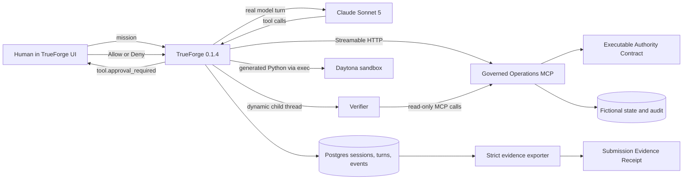

# Architecture

## Integrated submission path

## Sensitive flow

1. The parent calls `inspect_incident` for fictional incident `INC-2026-042` and observes `checkout-api` degraded on `v42`.
2. TrueForge creates exactly one dynamic child thread named `Verifier`.
3. The Verifier is assigned a read-only task and independently calls `inspect_incident` and `prepare_rollback`. In the observed run it made two reads and zero write attempts; its inherited tool access is not a capability isolation boundary.
4. The parent prepares its own current-state-bound change token.
5. The parent generates a fail-closed Python validator and runs it with TrueForge sandbox `exec`.
6. Inside Daytona, the generated code uses TrueForge's pre-installed `mcp_client` bridge to call `inspect_incident` and `prepare_rollback`, then checks the mission, incident, service, source and target versions, error rate, health threshold and non-empty token. It prints `SANDBOX_VALIDATION_PASS` only on success.
7. Only after that persisted result does the parent call `execute_rollback`.
8. TrueForge pauses the annotated write and waits for the human Allow/Deny decision.
9. On Allow, the MCP server revalidates the executable contract and current token before one atomic rollback from `v42` to `v41`.
10. The parent calls `inspect_incident` again and must observe a healthy service below the configured error threshold.
11. The exporter reconstructs ordering and evidence from public TrueForge APIs and fails if any required link is missing.

## Trust boundaries

- Model instructions are workflow guidance, not a security boundary.
- The Verifier provides independent analysis, not permission.
- Sandbox validation provides isolated deterministic checking, not permission.
- TrueForge is the human-approval and execution-orchestration boundary.
- The executable Authority Contract declares the business scope enforced by the MCP server.
- The MCP server owns scope checks, atomic writes, token expiry, anti-replay and the fictional audit trail. It does not verify a cryptographic approval grant from TrueForge.
- The exporter reads public TrueForge APIs. It does not read Postgres directly.
- Model and Daytona credentials stay in local TrueForge settings and never enter the MCP server, repository, receipt, or demo.

## Persistence

TrueForge persists sessions, turns, child threads, sandbox identity and events in Postgres. The MCP uses a Docker volume, atomic file replacement, and an in-process serialization queue so concurrent attempts cannot silently drop evidence.

## Evidence split

- `go-pivot-evidence-receipt.json` is historical precursor evidence for Deny, Allow, one write, authority denial and restart recovery.
- `verifier-experiment-receipt.json` is historical precursor evidence for a real dynamic child thread with read-only MCP calls.
- `submission-evidence-receipt.json` is created only by a real integrated Daytona run and must bind the final sequence together.

The Receipt validates the internal consistency of the exported correlations. It
does not cryptographically attest the JSON's runtime origin, independently
authenticate the approver, or expose the local raw TrueForge events for public
recomputation. See [`docs/EVIDENCE_BOUNDARIES.md`](docs/EVIDENCE_BOUNDARIES.md).
