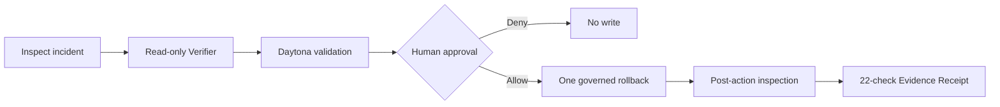

<p align="center">
  
</p>

<h1 align="center">ArcadeOps Mission Control</h1>

<p align="center">
  <strong>Human authority for autonomous agents</strong><br>
  One action. One human decision. One portable evidence receipt.
</p>

<p align="center">
  <a href="https://github.com/Damso74/arcadeops-mission-control/actions/workflows/ci.yml"></a>
  <a href="https://damso74.github.io/arcadeops-mission-control/evidence_console/"></a>
  <a href="LICENSE"></a>
</p>

<p align="center">
  <a href="https://youtu.be/U9GKftMHWjM"><strong>Watch the 118-second demo</strong></a>
  ·
  <a href="https://damso74.github.io/arcadeops-mission-control/evidence_console/"><strong>Open the Evidence Console</strong></a>
  ·
  <a href="#qodo-code-review-evidence"><strong>Inspect the Qodo trail</strong></a>
</p>

ArcadeOps demonstrates proof-carrying approval for a fictional, local incident-response agent built on
[TrueForge](https://github.com/truefoundry/trueforge) for the 2026 Agent Harness
Hackathon. The agent can prepare a recovery, but it cannot grant itself write
authority. Independent verification, isolated validation, a native human
approval and an executable policy all have to agree before exactly one rollback
can run.

> Agents can prepare. Humans authorize. The Receipt carries the correlated evidence.

## See it work

<p align="center">
  <a href="https://youtu.be/U9GKftMHWjM">
    
  </a>
</p>

The demo follows one complete mission: `checkout-api` is degraded after the
fictional deployment of `v42`. The agent may investigate and propose a rollback
to stable `v41`, but it receives no broader deployment authority.

```text
MCP inspection → Verifier → Daytona sandbox → human approval → one rollback → Evidence Receipt
```

## Why this is an agent harness project

ArcadeOps is not a chat interface around a model call. TrueForge owns the
runtime mechanics that make the agent operational:

- real model turns and MCP tool discovery;
- a dynamic `Verifier` child thread assigned a read-only task;
- generated validation code executed in a Daytona sandbox;
- a native Allow/Deny checkpoint for the write tool;
- persisted sessions, turns, tool calls and sandbox events.

The project adds the narrow operational contract, the governed MCP server and a
strict evidence exporter. It does not recreate the harness.

## The governed path



1. **Inspect:** the parent reads the fictional incident through real MCP tools.
2. **Challenge:** TrueForge creates exactly one `Verifier`, which is assigned a
   read-only task. In the observed run it made two MCP reads and zero write attempts;
   any write attempt would still encounter TrueForge's approval policy.
3. **Validate:** the agent generates a fail-closed Python validator. Daytona
   runs it against the MCP bridge and must return `SANDBOX_VALIDATION_PASS`.
4. **Pause:** TrueForge stops on `execute_rollback` and waits for a human Allow
   or Deny decision.
5. **Enforce:** the MCP server rechecks the executable Authority Contract,
   caller identity, current state, expiry and single-use token.
6. **Prove:** a fresh inspection must show `v41`, `healthy` and `0.7%` errors.
   The exporter then reconstructs the full order from persisted TrueForge APIs.

## Evidence at a glance

| Gate | Persisted evidence | Result |
| --- | --- | :---: |
| TrueForge runtime | Real model, MCP, child thread, sandbox and session events | PASS |
| Independent verification | One `Verifier`, two MCP reads, zero write attempts | PASS |
| Daytona isolation | Real sandbox id, generated validator and exact pass marker | PASS |
| Human authority | Native approval request correlated to an Allow input received through the local TrueForge UI | PASS |
| Write containment | Exactly one authorized `v42 → v41` rollback | PASS |
| Recovery | Fresh inspection reports `healthy` at `0.7%` errors | PASS |
| Evidence integrity | All 22 required checks are true | **22/22** |

The public
[Authority Ledger](https://damso74.github.io/arcadeops-mission-control/evidence_console/)
reconstructs the final persisted session as an inspectable chain of evidence. Select any event to
compare expected and observed state, open the source records, or challenge an in-memory copy with
six adversarial mutations. It reads the versioned
[Evidence Receipt](evidence/submission-evidence-receipt.json) and fails closed: remove any required
proof and every operational success claim disappears.

The Ledger also validates the earlier persisted acceptance trial that records both negative paths:
a native human Deny caused zero writes, and an out-of-scope request was refused by the executable
Authority Contract with zero state change. That historical run explicitly discloses that it did not
use Daytona or a subagent.

## Evidence status

| Item | Value |
| --- | --- |
| Persisted TrueForge session | `01m15rnk2bggz4dqdbhmcfr7js` |
| Public evidence surface | [Evidence Console](https://damso74.github.io/arcadeops-mission-control/evidence_console/) |
| Versioned evidence | [Evidence Receipt](evidence/submission-evidence-receipt.json) |
| Portable verifier | `node bin/arcadeops.mjs verify evidence/submission-evidence-receipt.json` |
| Required checks | 22 / 22 verified |
| Final status | `SUBMISSION_ACCEPTANCE_PASS` |

The TrueForge session itself is local by design. The runtime runs on the
participant's machine at <http://127.0.0.1:8791>, so its session view is not
publicly reachable. The public audit surface is reconstructed from that session
into the versioned Receipt and rendered by the public console.

The Daytona sandbox identifier is published only as a SHA-256 digest
(`sandbox_references[].id_sha256`) so the tenant-scoped id stays confidential. It
remains correlated to this run by the persisted execution evidence: a ready
`daytona` provider, the recorded sandbox `exec` calls, the generated read-only
MCP-bridge validator and its exact `SANDBOX_VALIDATION_PASS` marker.

The persisted approval sequence also took real time. TrueForge requested approval at
`2026-08-29T03:24:09.170Z` and the Allow input was recorded at
`2026-08-29T03:24:42.589Z`, roughly 33 seconds later. The single write ran only
after that decision. The Receipt proves the persisted UI input and ordering, not
the independently authenticated identity of the approver.

## Trust boundaries

| Responsibility | Owner |
| --- | --- |
| Model loop, MCP discovery, subagents, sandbox and persistence | TrueForge |
| Human Allow/Deny pause and tool-call resumption | TrueForge |
| Declared mission scope and permitted write | Executable Authority Contract |
| Scope enforcement, atomic state change, token expiry, anti-replay and audit | Governed Operations MCP server |
| Evidence reconstruction and ordering checks | ArcadeOps exporter |

Prompts guide the workflow, but they are not a security boundary. The Verifier
may challenge the plan, and Daytona may validate it, but neither can grant
permission. TrueForge enforces the human checkpoint. Separately, the MCP server
enforces mission scope, current state, token expiry, anti-replay and the one-write
budget; it does not verify a cryptographic approval grant from TrueForge.

## Evidence boundaries

The public Receipt validates the internal consistency of an export derived from
persisted TrueForge APIs. It correlates the session, Verifier, Daytona execution,
approval input, governed write and fresh postcondition, then fails closed when a
required record becomes missing or inconsistent.

It does **not** cryptographically attest the runtime origin of the JSON, independently
authenticate the approver, or let a public verifier recompute the export from raw
TrueForge events. These limits are documented in
[`docs/EVIDENCE_BOUNDARIES.md`](docs/EVIDENCE_BOUNDARIES.md).

## Quick start: inspect the public evidence

No model key or Daytona account is required to inspect the versioned receipt
and console locally.

```powershell
git clone https://github.com/Damso74/arcadeops-mission-control.git
Set-Location arcadeops-mission-control
python -m http.server 4173 --bind 127.0.0.1
```

Open <http://127.0.0.1:4173/evidence_console/>.

Verify the same chain without a browser:

```powershell
node bin/arcadeops.mjs verify evidence/submission-evidence-receipt.json
```

The command exits non-zero and reports a stable refusal code when authority, ordering, scope,
sandbox, recovery, or write-budget evidence is missing or inconsistent.

## Reproduce the full workflow

The integrated run uses a real model and may create Daytona resources. Run it
only with accounts and credentials you are authorized to use.

<details>
<summary><strong>Prerequisites and full setup</strong></summary>

### Prerequisites

- Docker Desktop
- Git
- Node.js 24
- Python 3.12+
- a supported model API key
- a Daytona API key

The verified environment is Windows with PowerShell and Docker Desktop.

### 1. Pin the verified TrueForge revision

```powershell
New-Item -ItemType Directory -Force .runtime | Out-Null
git clone https://github.com/truefoundry/trueforge.git .runtime/trueforge
git -C .runtime/trueforge checkout d421135dcfc802e08655d12c119e18ed715db2ef
```

### 2. Configure local secrets

```powershell
Copy-Item .env.example .env.requalification
python -c "import secrets; print(secrets.token_urlsafe(32))"
```

Put credentials only in the ignored `.env.requalification` file. Never paste
them into issues, pull requests, logs, screenshots or videos.

### 3. Start TrueForge and the governed MCP server

```powershell
powershell -NoProfile -ExecutionPolicy Bypass -File .\runner\resume_requalification.ps1 -Configure
docker compose --env-file .env.requalification -f compose.mcp.yml up -d --build
python runner/configure_governed_pivot.py
python runner/configure_submission_agent.py
```

### 4. Run the integrated mission

```powershell
python runner/start_submission_acceptance.py
```

When TrueForge pauses `execute_rollback`, make the decision yourself at
<http://127.0.0.1:8791>. The script never approves on the participant's behalf.

After an allowed run completes:

```powershell
python runner/export_submission_receipt.py `
  --session-id <INTEGRATED_SESSION_ID> `
  --output evidence/submission-evidence-receipt.json
```

</details>

## Verification

```powershell
python -m unittest discover -s runner -p "test_*.py" -v
npm --prefix mcp_server ci
npm --prefix mcp_server test
npm --prefix mcp_server audit --omit=dev --audit-level=high
```

The suites cover workflow ordering, Receipt and historical-trial validation, portable CLI behavior,
six adversarial console mutations, authorization denial, expiry, replay, concurrency and the MCP
black-box contract. The same checks run in
[Submission CI](https://github.com/Damso74/arcadeops-mission-control/actions/workflows/ci.yml).

`demo_project/` is the preserved unsafe baseline from the original spike.
Its standalone policy test is expected to fail on
`requires_human_approval=false`; that refusal is the experiment's evidence, not
part of the passing submission suite.

## Project map

| Path | Purpose |
| --- | --- |
| [`mcp_server/`](mcp_server/) | Governed rollback tools, executable contract and black-box tests |
| [`runner/`](runner/) | TrueForge configuration, acceptance runner and strict exporter |
| [`evidence_console/`](evidence_console/) | Receipt-backed Authority Ledger, Evidence Inspector and adversarial workbench |
| [`bin/arcadeops.mjs`](bin/arcadeops.mjs) | Portable fail-closed Receipt verifier |
| [`schemas/`](schemas/) | Public JSON Schema for portable evidence tooling |
| [`evidence/`](evidence/) | Versioned precursor and final Evidence Receipts |
| [`demo_assets/`](demo_assets/) | Versioned renderer and media verification; private capture inputs stay local |
| [`ARCHITECTURE.md`](ARCHITECTURE.md) | Detailed runtime and trust-boundary design |
| [`DEMO_RUNBOOK.md`](DEMO_RUNBOOK.md) | Safe recording and live-demo procedure |
| [`AUTHORITY_CONTRACT.md`](AUTHORITY_CONTRACT.md) | Human-readable authorization model |
| [`SUBMISSION.md`](SUBMISSION.md) | Judge-ready project description, limitations and disclosure |
| [`docs/history/`](docs/history/) | Historical spike and planning records, superseded by the final state |

## Qodo Code Review Evidence

Every substantive change was developed through a public pull request and human
merge. The table records the actual Qodo evidence, including where the final
automated follow-up landed shortly after merge rather than before it.

| Pull request | Scope | Review outcome |
| --- | --- | --- |
| [#1](https://github.com/Damso74/arcadeops-mission-control/pull/1) | Initial governed agent and MCP hardening | 6 findings resolved, follow-up: 0 bugs |
| [#2](https://github.com/Damso74/arcadeops-mission-control/pull/2) | Safe Rollback, Receipt and Evidence Console | 11 findings resolved across three passes |
| [#3](https://github.com/Damso74/arcadeops-mission-control/pull/3) | Public evidence and reproducible demo tooling | 6 findings resolved, final review: 0 bugs |
| [#4](https://github.com/Damso74/arcadeops-mission-control/pull/4) | Judge-ready README and submission alignment | CI and GitGuardian passed |
| [#5](https://github.com/Damso74/arcadeops-mission-control/pull/5) | Human-first Evidence Console | Qodo-reviewed, CI and GitGuardian passed |
| [#6](https://github.com/Damso74/arcadeops-mission-control/pull/6) | Verified Mission Replay and receipt-derived claims | 2 findings resolved, final review: 0 bugs, 0 violations |
| [#7](https://github.com/Damso74/arcadeops-mission-control/pull/7) | Submission evidence, provenance and judge documentation | 2 findings resolved, final review: 0 bugs, 0 violations |
| [#8](https://github.com/Damso74/arcadeops-mission-control/pull/8) | Authority Ledger and portable evidence verification | 2 correlation and schema-drift findings resolved; final Qodo follow-up on `02ea48e` landed after merge |
| [#9](https://github.com/Damso74/arcadeops-mission-control/pull/9) | Demo remaster and narration-aligned scenes | Initial review on `cbc0c0a`; corrections on `b36e2b0` and `82db0d4`; final Qodo summary landed nine seconds after merge |
| [#10](https://github.com/Damso74/arcadeops-mission-control/pull/10) | Final authority evidence, public demo and submission alignment | Initial review on `916f480`: 2 findings resolved; exact-head Qodo follow-up is the merge gate |

All nine previously merged PRs passed the repository's required automated checks. PR #8
and #9 do not establish the strict review-before-merge sequence for their final
SHAs; the final submission PR is required to close that process gap before merge.

## Safety, scope and disclosure

- All incidents, services, metrics and writes are fictional and local-only.
- No production account, customer system or personal record is connected.
- The session records an approval input received through the local TrueForge UI.
  The Receipt does not independently authenticate or identify the approver.
- Generated narration and video files are intentionally ignored; their source,
  renderer and verification tooling are versioned.
- This standalone repository's public implementation history begins during the
  August 24-30 hackathon window. It does not connect to or submit the pre-existing
  ArcadeOps SaaS codebase.
- Claude Code assisted with the initial spike, MCP hardening and black-box test
  design. OpenAI Codex assisted with implementation, runtime integration,
  verification, correction and documentation. Damien reviewed the merged work
  and is responsible for understanding and explaining the submission.

Licensed under the [MIT License](LICENSE). See the official
[hackathon rules](https://www.wemakedevs.org/hackathons/trueforge/rules).
